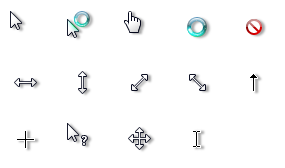

# Aero-White Shadow

A fork of the excellent cursor theme **[Windows Vista cursors for Linux](https://www.pling.com/p/2061622/)** and **[my other cursor shadow project based on Classic-Flat-White](https://github.com/lucas-bortoli/Aero-White-Shadow)** adding Windows-like shadows.
 
The shadow parameters may be changed in the `build_all.sh` file (follow [ImageMagick's shadow documentation](https://legacy.imagemagick.org/Usage/blur/#shadow) for reference). The build file requires imagemagick and xcursorgen.
